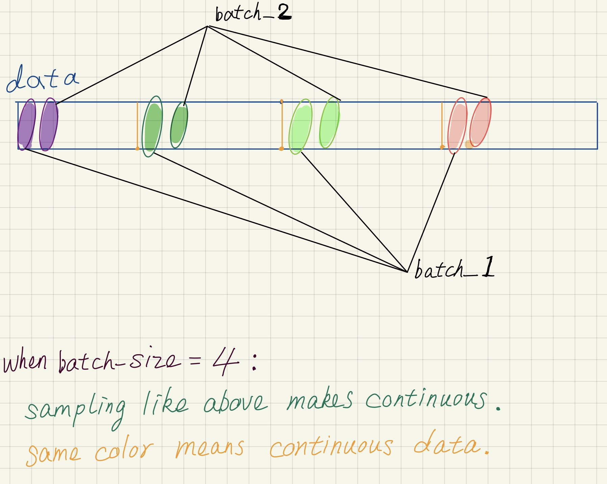

# Building a Simple LSTM System with Pytorch (Pytorch搭建简单LSTM系统)

## * Requirements

1. python3.6
2. torch1.0

## * Run the code

1. In windows: execute `start run.bat` in the cmd in this dir.
2. In linux: execute `./run.sh` in bash in this dir. (your needs `chmod` to give `execute right`)

> or

1. In windows CMD: execute `python train_use_conf.py > ./log/yourLOgName &`  at root dir of this projct.
2. In linux bash: execute `python train_use_conf.py > ./log/yourLogName &` at root dir of this projct.

## * DataSet

1. Chinese Book *平凡的世界*.
2. Chinese ancient Poetry. (Different word segmentation method makes very different result)

---
---------------------*en_version*-------------------------

## Main module

In general, a DNN system is built with the help of framework like tensorflow, pytorch or MXnet. I choose pytorch for it's simplicity.

Most of DNN systems have 2 main module:

- Training module
- Test module

## 1. Training module

As below, a Training module consists 4 parts:

1. data processing part
2. data inputing part
3. net structure building part
4. net training part

Among all of 4 parts, we can do the net structue building later, because we can build it easily in some general pattern.

As a beginner, we should concentrate more on data processing and data inputing part. Modern machine algorithm is useless without data. No data, No Magic.

Make a assumption:

- **No data**: We can't get anything with DNN.
- **Data was changed by accident**: Sorry, our training has gone far away from truth.
- **We can't transform data to the form what we need**(trust me, there's such kind of needs): Sorry, we also can't start our training.

Always ba careful about your data. There's no Out of the box data for your own needs.

## 1.1 data processing part

## 1.2 data inputing part

When input data to the Net, pytorch demands more uniformed data form. Pytorch supply a `DataSet` class for pack the data from raw. A `Dataloader` is supplied for customize the sampling of dataset.

It's all for the follow needs:

- determining input sequence length: LSTM require a input sequence. it process a long sequence data and make use of the relation between continuous words.
- determining batch division: DNN use **batch** to speed up the training. A batch is several sequences data stacked into a matrix, so DNN can output several results once. **But there is problem in LSTM, We more need 2 sequences which are processed continuously to be continuous in data. In this way the relation can be transmit to more later LSTM process.**

For demands, we are customizing the `DataSet` and `Dataloader` class:

1. **When customizing a `DataSet`**, we divide the data into sequences with length as 100(or whatever). This can be customized in `__init__()` of `DataSet`
2. **When customizing `Dataloader`**, we mainly change the sampling method to make the sequence be continuous(but if no batch, `Dataloader` can supply a simple way `sampler=SeqBatchSampler` to make continuous). What we need is to customize `sampler` class's `__iter__()`, doing the sampling like what happened in pic below.It will finally make the training to use continuous data.(This can be found in `SeqSampler.py`)

## 1.4 Net training part

Net training consists some techniques:

1. Choosing loss function: By choosing a loss function, net can correctly backpropagating.
2. Choosing the gradient optimizer.
3. Choosing file path to save checkpoint and model.

---

---------------------*zh_version*-------------------------

## 主要模块

DNN系统的简单搭建需要依赖深度学习框架进行，pytorch是一个非常好的选择，使用的逻辑比较简单易懂。

通常DNN系统包括两个大部分：

- 训练模块
- 测试（预测）模块

## 1. 训练模块搭建

一个DNN模型的训练模块的构建应当包括几个部分：

1. 数据预处理模块
2. 数据输入模块
3. 网络模型编写
4. train代码

其中网络模型和train的代码的构建是较为模式化的，不需要投入过量的精力。

我们需要对数据的处理和输入加以重视，数据于模型如同燃料于汽车，这一点在自然语言处理中尤甚。

我们做如下假设：

- 数据预处理中，数据被篡改
- 数据无法被处理成我们需要的格式

以上两种假设，一个导致模型脱离现实，另一个则使得训练根本无法开始，如同无米之炊。

即使你找到了开源的规范化数据集，你也会发现，数据集仍旧需要进行处理再进入你自己的DNN系统

### 1.1 数据预处理模块

预处理:

- 去除无关文字、标题
- 去除无关符号

### 1.2 数据输入模块

数据输入网络时，需要被组织成相对于pytorch来说规范的数据格式，pytorch提供了Dataset模块对于数据进行打包、提供了Dataloader对打包好的数据进行加载使用。

- 针对LSTM（数据前后强依赖）模型的输入会有如下需求：
  1. **确定序列长度**:LSTM的输入是一个词序列，我们需要确定一次序列的长度
  2. **确定batch划分**:为加速训练效率，DNN网络的输入通常以batch进行训练，同一神经单元同时对batch上的所有单个数据进行处理。数据输入的shape(batch_size, 序列长度)，最后网络输出的是batch_size个结果。不同于一般DNN的数据集batch随机划分，针对于处理序列数据的LSTM，各个batch间需要保持数据连续性（batch内部），只有这样batch间才能传递文本的连续信息。

- 通过对于Dataset，Dataloader进行定制，我们可以满足对数据的需求：
  1. **自定义Dataset类的数据初始**要确定好输入数据的句子序列长度，假设想变为100，通过定制__init__()函数，可以定制数据从文件读取后地形状，改为(-1, 100)
  2. **自定义Sampler对数据抽样**然后根据batch\_size确定如何通过定制采样函数，完成连续抽样和随机抽样。（参考repo：pytorch\_punctuation的代码，它对于batch的采样，几乎等于随机采样。因为当batch大于1时，将两个连续的句子作为一个batch，各batch间数据断开$batch\_size-1$的距离，训练时失去了相邻两句话之间的信息传递！！！！！）
     - batchSampler和其他Sampler类都继承了sampler类。更改__iter__()函数，将返回用于确定从dataset中getitem()的*index*列表迭代器。index被用来调用Dataset的__getitem__()获取对应数据。

## 1.3 网络模型搭建

## 1.4 train部分

1. 选择损失函数Loss
2. 选择梯度计算优化器，Adam
3. 选择check-point路径
4. 记录最佳损失Loss

定制train代码，选择mini-batch反向传递策略，还有epoch反向传递更新一次的策略？？？

## 2. 测试模块

## 画图

- viznet
- visio
